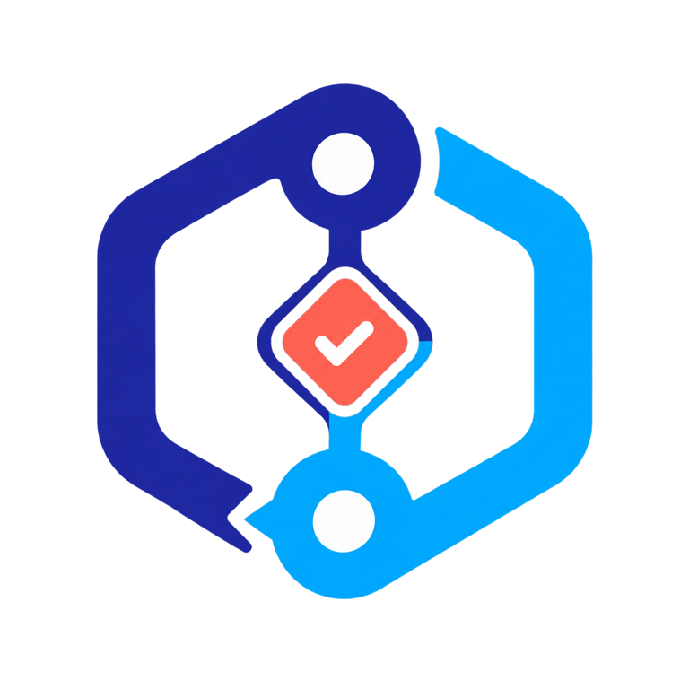

# Agent Connector SDK

<p align="center">
  
</p>

<p align="center">
  <b>Build secure connectors once. Serve, synchronize, and write back through one governed contract.</b><br>
  <sub>The typed source-integration boundary for MCP services and Epistemic Graph.</sub>
</p>

[](https://pypi.org/project/agent-connector-sdk/)
[](https://github.com/Knuckles-Team/agent-connector-sdk/actions/workflows/release.yml)
[](https://knuckles-team.github.io/agent-connector-sdk/)
[](https://github.com/Knuckles-Team/agent-connector-sdk/stargazers)
[](https://github.com/Knuckles-Team/agent-connector-sdk/forks)
[](https://github.com/Knuckles-Team/agent-connector-sdk/graphs/contributors)
[](LICENSE)
[](https://github.com/Knuckles-Team/agent-connector-sdk/commits/main)
[](https://github.com/Knuckles-Team/agent-connector-sdk/pulls)
[](https://github.com/Knuckles-Team/agent-connector-sdk/pulls?q=is%3Apr+is%3Aclosed)
[](https://github.com/Knuckles-Team/agent-connector-sdk/issues)
[](https://github.com/Knuckles-Team/agent-connector-sdk)
[](https://github.com/Knuckles-Team/agent-connector-sdk)
[](https://github.com/Knuckles-Team/agent-connector-sdk)
[](https://github.com/Knuckles-Team/agent-connector-sdk)
[](https://pypi.org/project/agent-connector-sdk/)
[](https://pypi.org/project/agent-connector-sdk/)
[](https://pypi.org/project/agent-connector-sdk/)
[](https://pypi.org/project/agent-connector-sdk/)

<p align="center">
  <a href="https://knuckles-team.github.io/agent-connector-sdk/">Documentation</a> ·
  <a href="https://knuckles-team.github.io/agent-connector-sdk/capabilities/">Capabilities</a> ·
  <a href="https://knuckles-team.github.io/agent-connector-sdk/extension-ports/">Interfaces</a> ·
  <a href="https://knuckles-team.github.io/agent-connector-sdk/status/">Status</a>
</p>

---

## Overview

Agent Connector SDK is the ecosystem's source-integration boundary. It turns
vendor APIs and domain tools into secure MCP connectors, transports bounded
source evidence into Epistemic Graph, indexes immutable repository snapshots,
and applies authorized changes back to source systems.

Connector packages retain vendor behavior. The SDK owns transport, lifecycle,
certification, and effect execution. Generated Epistemic Graph contracts own
durable graph records, checkpoints, content identity, and receipts.

Package version: 0.1.0.

## Key Capabilities

- Build FastMCP servers with authentication, safe exposure, health, visibility,
  rate limits, change subscriptions, and consistent tool surfaces.
- Publish skills, prompts, ontologies, SHACL shapes, and connector manifests as
  typed MCP content.
- Extract bounded source pages and advance checkpoints only from matching
  durable Epistemic Graph receipts.
- Import deterministic ConnectorPack archives without copying graph DTOs or
  digest algorithms into connector packages.
- Stream authenticated immutable repository snapshots into the generated
  `IndexRepository` boundary without becoming a semantic writer.
- Govern write-back through dry-run, authorization, source-version checks,
  idempotency, and uncertain-effect reconciliation.
- Certify extension identity, live MCP schemas, pagination, and safety behavior
  before activation.

## Documentation

Start with [Build your first connector](https://knuckles-team.github.io/agent-connector-sdk/tutorial/),
then choose the reference that matches the work:

- [Documentation home](https://knuckles-team.github.io/agent-connector-sdk/)
- [Capabilities](https://knuckles-team.github.io/agent-connector-sdk/capabilities/)
- [Architecture](https://knuckles-team.github.io/agent-connector-sdk/architecture/)
- [Connector servers](https://knuckles-team.github.io/agent-connector-sdk/connector-servers/)
- [Source synchronization](https://knuckles-team.github.io/agent-connector-sdk/connector-sync/)
- [Repository ingestion](https://knuckles-team.github.io/agent-connector-sdk/repository-ingestion/)
- [Extension interfaces](https://knuckles-team.github.io/agent-connector-sdk/extension-ports/)
- [Current status](https://knuckles-team.github.io/agent-connector-sdk/status/)

Sibling authorities: [Epistemic Graph](https://knuckles-team.github.io/epistemic-graph/)
owns durable graph state and generated contracts; [Graph OS](https://knuckles-team.github.io/graph-os/)
owns authenticated runtime composition.

## Architecture


| Boundary | Owned here | Owned elsewhere |
|---|---|---|
| Connector service | MCP lifecycle, exposure policy, content capture, certification | Vendor models and business semantics stay in the connector package. |
| Source ingest | Discovery, bounded extraction, transport, receipt verification | Epistemic Graph owns mapping, checkpoints, provenance, and commit receipts. |
| Repository ingest | Authenticated snapshots, stable manifests, bounded object transport | Epistemic Graph owns indexing, graph projection, and semantic interpretation. |
| Write-back | Preview, source-version checks, apply, and reconciliation | Epistemic Graph owns change sets, authorization decisions, and durable outcomes. |
| Runtime composition | Typed ports and verified dependency requirements | Graph OS supplies authenticated identity, clients, and live authority. |

The SDK depends directly on `epistemic-graph>=2.27.0`. Generated SourceIngest,
ConnectorPack, IndexRepository, and WriteBack clients and models are the graph
boundary; the SDK adds no parallel graph contract.

## Quick Start

Create a project and install the SDK:

```bash
uv init --bare demo-connector
cd demo-connector
uv add agent-connector-sdk
uv sync
uv run connector-sync --help
```

The command prints the supervised synchronization options without opening a
source session. Continue with the
[connector tutorial](https://knuckles-team.github.io/agent-connector-sdk/tutorial/)
to build and run a one-file MCP connector, observe its health response, add
declarative content, certify the live schema, and join source synchronization.

## Contributing

Issues and pull requests are welcome. Follow [AGENTS.md](AGENTS.md) for ownership,
isolation, and validation rules, and run the affected tests and public-surface
gates before submitting a change.

## License

Agent Connector SDK is released under the [MIT License](LICENSE).
