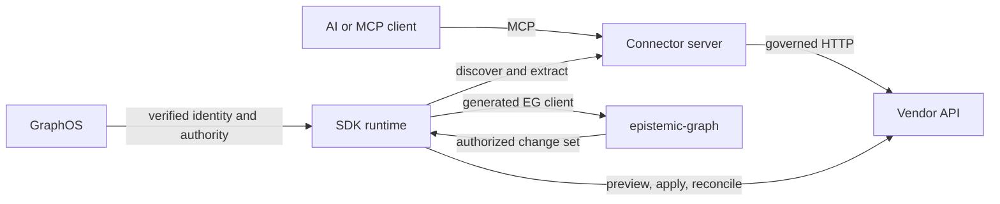
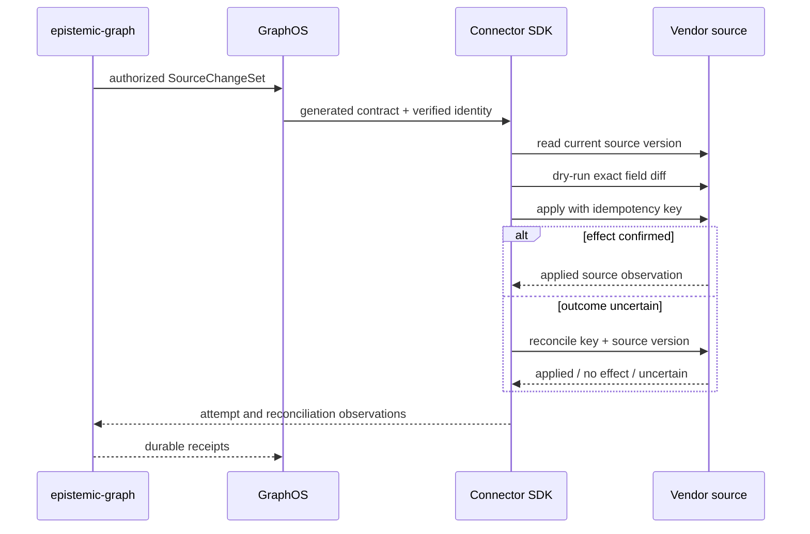

# Architecture

The Agent Connector SDK is the connector transport and lifecycle layer between
MCP clients, vendor systems, GraphOS, and epistemic-graph. It keeps vendor I/O
replaceable while one generated graph contract owns durable identity and state.

## Responsibility boundary

  

    

      
Connector

      
Vendor API models, requests, paging tokens, source versions, and external effects.

    

    

      
Agent Connector SDK

      
MCP serving, source capture, bounded transport, certification, scheduling, and governed effect execution.

    

    

      
epistemic-graph

      
Generated contracts, graph schemas, source checkpoints, content identity, provenance, reasoning, and durable receipts.

    

    

      
GraphOS

      
Verified runtime identity, authority injection, service composition, and external protocol exposure.

    

  

The SDK depends directly on `epistemic-graph>=2.27`. Generated SourceIngest,
ConnectorPack, and WriteBack models and clients are the sole graph boundary. The
SDK does not copy graph request DTOs, receipt types, or digest algorithms.

## Shared runtime

The same SDK policies guard connector serving and background source work.
Transport changes do not create another content catalog, checkpoint store, or
authorization model.

## Source lifecycle

<ol class="site-flow">
  <li class="site-flow__step">
    
Discover

    
The SDK verifies the live MCP tool contract against the connector manifest and certified fingerprints.

  </li>
  <li class="site-flow__step">
    
Extract

    
A source adapter returns one bounded page with raw records, provenance, lifecycle mode, and the provider checkpoint.

  </li>
  <li class="site-flow__step">
    
Commit

    
The SDK submits EG's generated SourceIngestionRequest with a stable idempotency key and the expected durable checkpoint.

  </li>
  <li class="site-flow__step">
    
Acknowledge

    
epistemic-graph maps, validates, deduplicates, persists provenance and outbox state, compare-and-swaps the checkpoint, and returns the sole receipt.

  </li>
</ol>

`full`, `delta`, and `reconcile` modes are explicit. Authoritative empty-source
operations require a non-empty approval descriptor and verified capability.
Provider content hashes are echoed when supplied and are never invented. The
next page starts only from the checkpoint bound by the matching receipt.

## ConnectorPack lifecycle

Connector content is listed through its own MCP server and captured once into
the generated ConnectorPack archive. Ontology and SHACL bodies remain the exact
served UTF-8/LF `text/turtle` bytes. The SDK does not parse or reserialize
identity-bearing Turtle.

The generated archive builder owns section hashes, URI ordering, and the
`mcp-server://<connector>` entry. epistemic-graph binds the archive to the
current catalog snapshot and computes the canonical pack digest. A matching
head is an acknowledged no-op. A concurrent head change causes one fresh status
read and a deterministic retry; every other typed rejection fails the cycle.

Pack annotations carry declared capability, modality, cost, latency, contract
version, and served MCP safety hints. Conflicting declarations fail closed.

## WriteBack lifecycle

epistemic-graph creates the change set, binds authorization and policy, and
persists attempt and reconciliation receipts. The SDK validates those generated
models, performs source-side preview and mutation through the connector port,
and blocks a retry while an effect remains uncertain.

## Failure and evidence

- Unknown authentication, unsafe exposure, schema drift, ambiguous mappings,
  stale checkpoints, receipt mismatches, and uncertified extensions fail closed.
- Credential values remain in memory and never enter manifests, source records,
  logs, health responses, or receipts.
- Every accepted source page is attributable to connector identity, stream,
  mapping, provider checkpoint, raw provenance, and an EG graph version.
- Health reflects the scheduler and its injected dependencies; it does not infer
  success from process existence alone.

See [Extension ports](extension-ports.md) for protocol details and
[Connector sync](connector-sync.md) for runtime configuration.
