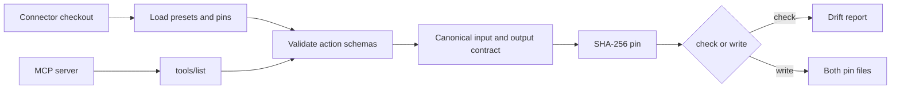

# Connector certification

`connector-certify` compares every MCP tool used by a connector's sync presets
with the client-visible contract returned by `tools/list`. It lists tools only;
it never calls a tool or reaches the connector's upstream API.



## Contract pin

The algorithm label is
`agent-connector-sdk:mcp-tool-contract-compat:v2`. Its digest binds the tool
name, canonical input schema and canonical output schema. Object keys are
sorted; string lists such as `required` and `enum` are sorted; presentation
fields (`title`, `description`, `examples`, `$comment`) and runtime defaults are
removed. Output-schema changes therefore invalidate the same pin that
`connector-sync` verifies before extraction.

An empty input schema is refused. If a preset selects an action, the tool's
action property must constrain that value with JSON Schema `enum`, or with
`const` for a single action. Action names in prose do not certify a callable
contract. A preset with `params_style: json` also requires its configured
`params_arg` property as a string.

## Run it

Start a connector over stdio by putting its command after `--`:

```bash
connector-certify ../sample-agent --check -- sample-mcp --transport stdio
connector-certify ../sample-agent --write -- sample-mcp --transport stdio
```

`--placeholder NAME` gives a stdio child a fixed non-secret placeholder.
`--env NAME=REFERENCE` resolves an `env://` or `openbao://` reference into the
child environment. These options exist for servers that need configuration to
start; tool listing must not require a real upstream credential.

For a deployed streamable-HTTP server, use a bearer-token reference or OIDC
client credentials:

```bash
connector-certify ../sample-agent --check \
  --url https://sample-mcp.example.invalid/mcp \
  --oidc-token-url https://identity.example.invalid/token \
  --oidc-client-id connector-certify \
  --oidc-client-secret-ref openbao://apps/connector-certify#OIDC_CLIENT_SECRET \
  --oidc-audience agent-services \
  --oidc-scope mcp:tools
```

`--oidc-issuer` may replace `--oidc-token-url`; the SDK discovers the issuer's
token endpoint. The SDK's governed HTTP client obtains and caches the token,
refreshes it before expiry, and retries once with a new token after a 401. The
secret stays a reference until token minting.

`--report PATH` writes a JSON report containing connector and server identity,
each pin location, the combined live pin, a separately visible output-schema
digest, and any defect. It does not include endpoint URLs or credentials.

| Exit | Meaning |
|---|---|
| `0` | every pin matches, or all certifiable pins were written |
| `1` | drift, an invalid empty-schema pin, an unpinned tool, or a refused write |
| `2` | invalid checkout or the server could not list tools |

`--write` replaces `connectors/tool_schema_fingerprints.json` and only the
`tool_schema_sha256` lines of `connector_manifest.yml`. It writes nothing unless
every preset tool has one live, non-empty, action-valid contract and verifies
the reparsed manifest before replacing either file. A durable transaction
journal restores the previous consistent pair if either replacement fails or a
later certification starts after an interrupted write.
