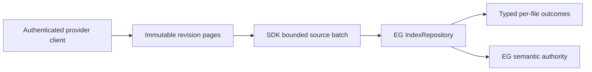

# Repository ingestion

Repository ingestion has one ownership path. A connector-owned provider client
authenticates to its Git forge and implements `RepositorySnapshotProvider`. The
SDK validates that the provider, authentication evidence, and requested
immutable revision agree; pages source blobs and tombstones; and submits bounded
source batches through the public epistemic-graph client. Epistemic-graph alone
parses files, resolves cross-file symbols, and owns every semantic or durable
graph effect.

Call `index_repository_snapshot(provider, client, revision, limits=...)`. The
revision uses the provider/project identity plus immutable revision and tree
identifiers. Each file carries a normalized repository-relative POSIX path, its
content, and a verified SHA-256 blob digest. Rename and deletion evidence travels
as `RepositoryTombstone`; it is preserved in the receipt and is never disguised
as parser input.

The receipt carries a canonical `RepositorySnapshotManifest`, sorted by logical
path. Its SHA-256 `fingerprint` binds the immutable revision, tree, file content
digests and byte lengths, plus rename/delete tombstones. Batch receipts retain
paths and the native EG result, not source bodies, so completed batches release
their blob memory.

The SDK combines provider pages until an engine batch reaches a file-count or
byte bound, then calls `client.graph.index_repository(files)` exactly once for
that batch. It does not serialize the engine wire protocol itself, inspect or
rewrite native nodes and edges, or issue graph mutations. The native result is
retained unchanged in `RepositoryBatchReceipt`.

Every result must contain one ordered `file_outcomes` item per submitted file.
The SDK checks the path, source-content digest, parser-capability digest, closed
`success | unsupported | error` status, and diagnostics container. Missing,
reordered, or malformed outcomes fail closed; an empty parse result can never be
reported as success by inference.

Provider cursors are ephemeral to this fetch. Repeated cursors, revision drift,
duplicate paths across pages, oversized files, or mismatched authentication stop
the run before another engine call. Durable repository admission, watermarks,
acknowledgements, reconciliation, parsing, cross-file linking, RDF/OWL/SHACL, and
projection receipts remain epistemic-graph responsibilities.
