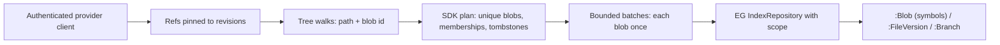

# Repository ingestion

Repository ingestion has one ownership path, and it is branch-aware. A
connector-owned provider client authenticates to its Git forge and implements
`RepositorySnapshotProvider`: it lists refs pinned to immutable revisions, pages
each revision's tree as `(path, Git blob id)` entries without content, and
fetches blob bytes by object id. The SDK enumerates every ref, dedupes blobs
across all of them, fetches and submits each unique blob exactly once, and sends
the `(ref, path) -> blob` memberships with it. Epistemic-graph alone parses,
resolves cross-file symbols, and owns every semantic or durable graph effect.

```mermaid
flowchart LR
    A[Authenticated provider client] --> B[Refs pinned to revisions]
    B --> C[Tree walks: path + blob id]
    C --> D[SDK plan: unique blobs, memberships, tombstones]
    D --> E[Bounded batches: each blob once]
    E --> F[EG IndexRepository with scope]
    F --> G[":Blob (symbols) / :FileVersion / :Branch"]
```

Call `index_repository(provider, client, prior=..., limits=...)`. Two branches
that share history share blobs, so indexing every branch costs barely more than
indexing one: a blob present on five branches is fetched, shipped and parsed once
and referenced five times.

## What one run does

1. `list_refs()` returns every ref; each must name the provider's repository and
   an immutable commit and tree. Refs pinned to the same revision share one tree
   walk. Provider cursors are ephemeral; repeated cursors, revision drift and
   duplicate paths stop the run before any engine call.
2. The plan collects unique Git blob ids. Each blob is submitted under its
   lexicographically smallest path, so the choice never depends on provider
   order. Only blobs with a recorded successful parse in `prior` are reused.
3. Blob bytes are streamed: fetched one at a time, verified against the Git
   object id (SHA-1 or SHA-256 repositories), hashed to a `sha256:` content
   digest, and released once their batch is accepted.
4. Every batch carries `IndexRepositoryScope`: the repository key
   (`<provider>:<repository_id>`), all declared refs (`live` or `deleted`), the
   memberships of its blobs, and tombstones. A blob always shares its batch with
   the membership naming the path it was submitted under.
5. The receipt's `manifest` (bound to repository and target graph; per ref:
   revision, `(path, blob id, digest, length, parse status, parser-capability
   digest)` files, tombstones) is the
   source inventory for the next run. `error` and `unsupported` files remain
   visible for rename/delete detection but are fetched and parsed again;
   neither can become a successful-parse skip marker. The manifest is not an
   engine-owned admission watermark or semantic receipt.

## Tombstones

Against `prior`, a path that left a ref, or whose blob changed, is tombstoned
under its prior digest; when the same blob reappears at a new path of that ref
the tombstone names it as `successor_path`. A ref missing since `prior` is
declared `deleted` with a tombstone for each of its prior files.

## Engine projection

Epistemic-graph parses each submitted blob once under a content-keyed name, so
symbol identity depends on content and grammar only. It attaches symbols to
`:Blob` (`blob:sha256:<hex>`), resolves imports per ref between `:FileVersion`
nodes (path + blob), and projects `:Branch -hasFileVersion-> :FileVersion
-hasBlob-> :Blob` plus `removesFileVersion` tombstone edges. The SDK validates
one ordered outcome per submitted blob (path, content digest, parser-capability
digest, closed `success | unsupported | error` status) and retains the native
result unchanged.

## Bounds

`RepositoryBatchLimits` bounds unique blobs per call (`max_files`, `max_bytes`,
`max_file_bytes`) and memberships plus tombstones per call
(`max_file_versions`). Blob content is never held beyond one batch; the tree
listings (paths and blob ids, no content) of all refs are held for the run.

`LocalGitRepositoryProvider` reads a repository on the local filesystem through
the git CLI and is the reference implementation of the port.
