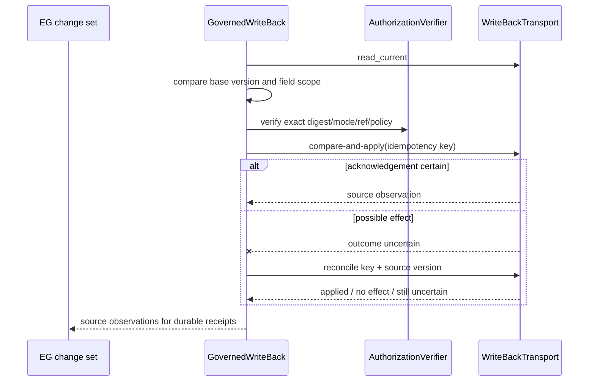

# Extension ports

Five typed protocols keep the SDK open. An implementation ships in its own
distribution and declares an entry point; nothing in the SDK changes.

| Port | Module | Entry-point group | Reference implementation |
|---|---|---|---|
| `SourceAdapter` | `ports.source_adapter` | `agent_connector_sdk.source_adapters` | `mcp_tool` |
| `ArtifactKind` | `ports.artifact_kind` | `agent_connector_sdk.artifact_kinds` | `tools`, `skills`, `prompts`, `resources` |
| `Transport` | `ports.transport` | `agent_connector_sdk.transports` | `mcp` |
| `Sink` | `ports.sink` | `agent_connector_sdk.sinks` | `epistemic_graph` (declared seam, W1) |
| `WriteBackPort` | `ports.writeback` | generated connector binding | `GovernedWriteBack` + fixture transport |

## SourceAdapter

| Method | Contract |
|---|---|
| `describe()` | capabilities, without I/O |
| `discover(session)` | verify the live source contract; required before extraction |
| `extract(session, cursor)` | one page and the cursor that resumes after it |
| `reconcile(session, known_ids)` | ids missing from the source and unknown to the sink |

The `mcp_tool` adapter extracts through a connector's MCP tool as a preset
describes it (pagination, a since-watermark), requires the pinned
`tool_schema_sha256`, and rejects records that do not match the preset. The
watermark advances only when a sweep is exhausted.

| `pagination` | Parameters | Next page |
|---|---|---|
| `none` | | none |
| `cursor` | `cursor_param`; `cursor_path` or `cursor_record_field`; optional `more_path` | the token, until it is absent or repeats |
| `page` | `page_param`, `page_size_param`, `page_size`, `start_page`; `page_kind` `number` (the spelling `page` is rejected) | the next page index, until a page is shorter than `page_size` |
| `offset` | `page_param` (the offset), `page_size_param`, `page_size`; `page_kind` `offset` | the offset plus the records returned, until a page is shorter than `page_size` |

A `page_kind` that does not apply to the mode is rejected. A preset with an
empty `id_field` is rejected: a sweep without record identity, such as a SQL
table sweep, belongs to a data-platform source adapter (RF-ADR-009 section 2.3).

The package validator rejects an old input-only algorithm and a
`tool_schema_sha256` equal to either generation's fingerprint of an empty input
schema. The current pin binds both input and output schemas. An action selected
by a preset must appear in the action argument's JSON Schema `enum` (or its
single-value `const` form). Re-certify from the server's `tools/list` with
[`connector-certify`](connector-certify.md).

## ArtifactKind

Prompt packs read both `prompts/list` and `prompts/get` through the same MCP
session. Each prompt entry retains its listing definition, the argument contract,
and the complete ordered MCP result, including roles, typed multimodal content,
resource references and response metadata. The capture records that it is a
rendered prompt with no supplied arguments; it does not claim to be a template
or a system prompt. Changed message content changes the pack digest.

Pack provisioning has no configured prompt-argument input. A prompt with required
arguments fails closed before retrieval; no values are invented. Optional
arguments are omitted so the server may apply its defaults. Empty, incomplete or
malformed results are rejected. Aggregate prompt capture uses the existing
16 MiB response-byte limit and fails before a pack can be acknowledged.

## Sink

| Method | Contract |
|---|---|
| `submit(batch)` | commit a record batch; the receipt is returned only after commit |
| `import_pack(pack)` | import a content pack keyed by its digest |
| `readiness()` | whether this sink can commit right now, without side effects -- returns a `SinkReadiness(ready, reason)`; `reason` is set whenever `ready` is `False` and must never carry a credential or other secret value |

The connector-sync runner's `/health/ready` (see [Connector sync](connector-sync.md)
"Health") calls `readiness()` directly, bounded by a short timeout, so a sink
implementation must answer it without a side effect and should not assume it
is ever skipped. `epistemic_graph` (the declared W1 seam) always reports not
ready, naming the wave that lands it; the testing kit's `InMemorySink` always
reports ready.

`RecordBatch` is the typed SDK handoff immediately before that native call. It
binds every record to one connector and cursor stream, rejects duplicate source
identities within a page, and includes the complete raw provenance in its batch
digest. The exact mapping reference, candidate cursor, and expected previous
cursor are digest-bound too. The runner sets `expected_previous_cursor` to the
cursor used to extract the page; it is `None` only when no cursor has ever been
committed for that connector stream. EG must compare-and-swap that expected
position atomically with the record commit, rejecting stale or out-of-order
pages. This is the furthest the SDK can map without taking ownership of EG's
ingestion schema.

A manifest mapping reference names one exact mapping:
`manifest:<connector>#schema_mappings/<key>`. The shorter
`manifest:<connector>` form is a convenience only for a manifest containing
exactly one `schema_mappings` entry. Package validation fails closed when the
short form is ambiguous or an explicit fragment names no declared key. Other
reference schemes remain opaque to the SDK and must identify an equally exact
mapping at their owning authority.

The current EG-generated client has no generic source-record method. Its two
nearby native calls are deliberately not substitutes:

- `SqlSourceBatch` appends typed cells to an existing SQL table. Its mapping
  descriptor is integrity/provenance content and is not interpreted or applied.
- `ApplyChangeEnvelope(s)` commits graph operations after mapping. It cannot
  accept the raw `SourceRecord` page or resolve a connector manifest mapping.

EG must publish the accepted `IngestionAuthorityV1` stage contract as generated
client calls and types. The first call after SDK extraction is
`CaptureRawRequestV1 -> RawCaptureResultV1`, followed by
`AdmitRawRequestV1 -> RawAdmissionResultV1`,
`ValidateBatchRequestV1 -> ValidationResultV1`,
`MapBatchRequestV1 -> MappedBatchResultV1`, and finally
`IngestBatchRequestV1 -> IngestResultV1`. `IngestBatchRequestV1` alone is not a
binding for `RecordBatch`: it receives mapped `ChangeEnvelopeV1` values, while
mapping and raw admission are EG responsibilities. Those calls must accept the
raw bounded records and complete source provenance, resolve the imported
manifest mapping reference, and bind the candidate cursor to its expected prior
value. The final result must bind the submitted batch digest, per-record
accepted/duplicate/rejected outcomes, and committed cursor. The native
transaction must deduplicate, append provenance/outbox records, advance the
cursor, and retain the terminal receipt before it acknowledges. Once those
generated calls exist, `EpistemicGraphSink.submit` can compose them without a
local schema copy; until then it continues to fail closed and readiness remains
false.

## Runner ports

The connector-sync runner adds three ports, described in
[Connector sync](connector-sync.md): `ConnectorRegistry` (`ports.connector_registry`),
`CheckpointStore` (`ports.checkpoint_store`) and `ChangeSource`
(`ports.change_source`).

## WriteBackPort

`WriteBackPort` is the D18 source-I/O boundary. It reads the current source
version, produces a side-effect-free field diff, rejects an optimistic conflict
before mutation, verifies an exact durable authorization decision, applies under
an idempotency key, and reconciles every possible effect before retry. The only
authorization modes are `proposal_approval`, `standing_policy`, and
`manual_trigger`; a mode or reference supplied by a caller grants nothing by
itself.

The canonical models come from `epistemic_graph.generated.write_back`.
`SourceChangeSet.canonical_digest()` and `.patch_digest()` implement EG's framed
MessagePack digest contract; the SDK neither reconstructs those schemas nor
implements a parallel digest. EG alone creates and persists `WriteBackReceipt`
and `ReconciliationReceipt`. No live vendor write-back is enabled by the
reference in-memory transport.

## Activation

`load_extension(group, name, policy=...)` loads an extension only when the
activation policy certifies its exact group, name, distribution and version.
There is no permissive default. `sdk_reference_extensions()` certifies the
implementations this SDK version ships. Two distributions declaring the same
name in a group is an error.

## Seam types

`agent_connector_sdk.contracts` holds the record, cursor, pack and receipt types
the SDK exchanges with epistemic-graph. epistemic-graph owns that schema; when it
publishes the contract, these types are replaced by generated ones.
